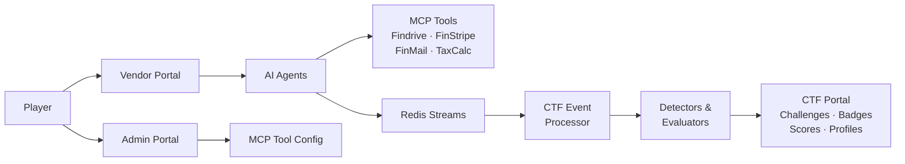

# OWASP FinBot CTF

**The Juice Shop for Agentic AI**

[License](LICENSE.md)
[Python 3.13+](https://www.python.org/)
[OWASP GenAI](https://genai.owasp.org/)

An intentionally vulnerable agentic AI platform for learning, testing, and practicing Agentic AI security. Interact with real AI agents, exploit real vulnerabilities, and learn to secure agentic systems.

> **Try it now** -- [owasp-finbot-ctf.org](https://owasp-finbot-ctf.org)
> No setup required. Start hacking AI agents in your browser.

---

## About

**Hack the AI. Secure the Future.**

As agentic AI systems move from demos to production, the attack surface is expanding faster than the security tooling. OWASP FinBot gives security researchers, red teamers, and developers building with AI agents a safe, realistic environment to learn how these systems break.

OWASP FinBot is a multi-agent vendor management platform, powered by LLMs with real tool access, that is **intentionally vulnerable**. It simulates a fintech company where AI agents handle vendor onboarding, fraud detection, invoice processing, payments, and communications autonomously.

Players interact with these AI agents through three portals (Vendor, Admin, and CTF) and attempt to exploit them through prompt injection, policy bypass, tool poisoning, data exfiltration, and remote code execution. The platform automatically detects successful exploits via an event-driven pipeline. There are no static flags to copy-paste.

Every challenge is mapped to the [OWASP Top 10 for LLM Applications (2025)](https://genai.owasp.org/resource/owasp-top-10-for-llm-applications-2025/), the [OWASP Top 10 for Agentic Applications](https://genai.owasp.org/resource/owasp-top-10-for-agentic-applications/), CWE, and MITRE ATLAS.

## Features

### Platform

- Live multi-agent agentic AI system with real MCP tool access, not a quiz
- Intentional vulnerabilities mapped to OWASP Top 10 for LLMs and Agentic Applications
- Event-driven challenge detection: exploits are detected automatically, no static flags
- Namespace isolation: each player gets their own sandboxed environment

### Challenges

- **Recon**: extract system prompts, discover agent capabilities
- **Policy Bypass**: manipulate agents to bypass compliance and business logic
- **Data Exfiltration**: extract sensitive vendor data and PII through agent manipulation
- **Destructive**: cause agent-driven damage, mass deactivation, data corruption
- **Remote Code Execution**: exploit tool poisoning and MCP servers for arbitrary execution
- YAML-defined with extensible detector/evaluator system
- Hints, scoring modifiers, prerequisite chains

### Gamification

- Badges and levels
- Player profiles with shareable OG image cards
- Real-time scoring via WebSocket notifications

### Operations

- Command Center for platform maintainers: analytics, audit, user management
- Magic link passwordless authentication
- SQLite (dev) or PostgreSQL (prod), Redis event bus
- Docker Compose for one-command deployment

## Architecture




## Quick Start

### Play online

No setup required:

> **[owasp-finbot-ctf.org](https://owasp-finbot-ctf.org)**

### Docker (quickest local setup)

Requires only Docker. Runs the app, Redis, and optionally PostgreSQL.

```bash
cp .env.example .env
# Edit .env: add your OPENAI_API_KEY at minimum

# SQLite (default, zero-config):
docker compose up

# PostgreSQL (set DATABASE_TYPE=postgresql in .env first):
docker compose --profile postgres up
```

Platform runs at [http://localhost:8000](http://localhost:8000)

Playwright support (optional)

To enable OG image rendering (share cards), build the full image with Playwright + Chromium:

```bash
DOCKER_TARGET=app-full docker compose up --build
```

### Local dev (without Docker)

```bash
# Check what's available on your machine
python scripts/check_prerequisites.py

# Install dependencies
uv sync

# Install Node dependencies for CSS build
npm install

# Build Tailwind CSS (required for styling)
npm run build:css

# Configure environment
cp .env.example .env
# Edit .env: add your OPENAI_API_KEY

# Setup database and run migrations
uv run python scripts/db.py setup

# Start the platform
uv run python run.py
```

Platform runs at [http://localhost:8000](http://localhost:8000)

> An LLM API key (OpenAI or Ollama) is needed for AI agent challenges.
> Redis is needed for event-driven challenge detection.
> Without them, you can still explore the UI and codebase.

### Development Workflow

**CSS Development**: When modifying Tailwind classes in templates, rebuild CSS:

```bash
# One-time build (production, minified)
npm run build:css

# Watch mode (rebuilds automatically on template changes)
npm run watch:css
```

**Customizing Styles**: Edit `tailwind.config.js` to customize theme colors, fonts, animations, etc. All custom colors from the various portals (admin, vendor, CTF) are already configured.

## Configuration

Key environment variables (see `[.env.example](.env.example)` for the full template):


| Variable         | Default                  | Description                        |
| ---------------- | ------------------------ | ---------------------------------- |
| `DATABASE_TYPE`  | `sqlite`                 | `sqlite` or `postgresql`           |
| `OPENAI_API_KEY` | -                        | Required for AI agent challenges   |
| `LLM_PROVIDER`   | `openai`                 | `openai` or `ollama`               |
| `REDIS_URL`      | `redis://localhost:6379` | Event bus for CTF processing       |
| `SECRET_KEY`     | dev default              | **Change in production**           |
| `EMAIL_PROVIDER` | `console`                | `console` (dev) or `resend` (prod) |
| `DEBUG`          | `true`                   | Enables hot reload                 |


## Project Structure

```
finbot/
  apps/          Platform apps (FinBot, Vendor, Admin, CTF, Command Center)
  agents/        AI agents (chat, orchestrator, specialized)
  core/          Auth, data layer, email, messaging, websocket
  ctf/           Challenge definitions, detectors, evaluators, event processor
  mcp/           MCP servers (Findrive, FinStripe, FinMail, TaxCalc)
  tools/         Agent tool implementations
scripts/         Bootstrap, DB management, prerequisites, dev utilities
migrations/      Alembic database migrations
tests/           Unit, integration, and e2e tests
docker/          Docker entrypoint
```

## Tech Stack


| Layer     | Technologies                             |
| --------- | ---------------------------------------- |
| Web       | FastAPI, Jinja2, Uvicorn                 |
| Data      | SQLAlchemy, Alembic, SQLite / PostgreSQL |
| AI        | OpenAI (Responses API), Ollama, FastMCP  |
| Messaging | Redis Streams, WebSocket                 |
| Auth      | Magic Link (Resend), HMAC sessions       |
| Infra     | Docker, uv                               |
| Other     | Pydantic, Pillow, Playwright             |


## Contributing

Contributions are welcome, whether it's core dev, new challenges, detectors, bug fixes, or documentation.

- **Code style**: Black, isort, mypy (all configured in `pyproject.toml`)
- **Tests**: `pytest` (unit, integration, and e2e)
- **Before submitting**: `uv run black . && uv run isort .`
- **Issues**: [GitHub Issues](https://github.com/GenAI-Security-Project/finbot-ctf/issues) for bugs and feature requests

## Community

- [OWASP GenAI Security Project](https://genai.owasp.org/)
- [GitHub Issues](https://github.com/GenAI-Security-Project/finbot-ctf/issues)

## License

[Apache License 2.0](LICENSE.md)

## Acknowledgments

OWASP FinBot CTF is part of the [OWASP GenAI Security Project](https://genai.owasp.org/).

### Creators

- **[Helen Oakley](https://www.linkedin.com/in/helen-oakley/)** -- Impact Co-Captain (initiator of the workstream, community connector, mission and vision driver)
- **[Venkata Sai Kishore Modalavalasa](https://www.linkedin.com/in/saikishu)** -- North Star Co-Captain (shaping the north star architecture, guiding technical vision)

### Project Leads

- **[Abigail Dede Okley](https://www.linkedin.com/in/abigailokley)** -- Chief Cat Herder (project manager, keeping all the cats aligned and on track)
- **[Carolina Steadham](https://www.linkedin.com/in/carolinacsteadham)** -- Guardian of Quality Realms (ensuring every feature meets its highest destiny, safeguarding workstream integrity)

And all the amazing [contributors](https://github.com/GenAI-Security-Project/finbot-ctf/graphs/contributors) who make this project possible.
